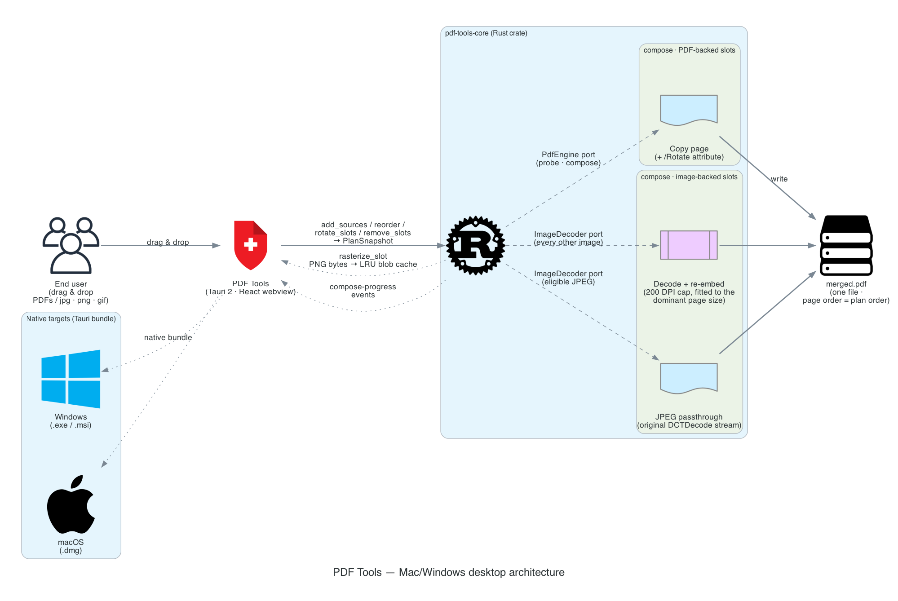

<div align="center">


# PDF Tools

[](https://github.com/yasuflatland-lf/pdf-tools/actions/workflows/ci.yml)
[](https://codecov.io/gh/yasuflatland-lf/pdf-tools)
[](https://codecov.io/gh/yasuflatland-lf/pdf-tools)
[](LICENSE)

A native desktop app (macOS / Windows) that merges **PDFs and images (jpg / png / gif)** into a
single PDF, in any page order you choose. Everything runs locally — **no file ever leaves your
machine, and the app makes no network requests at all.**

</div>

## Why

Merging a PDF is routine office work, but every existing option has a catch:

- **Adobe Acrobat** is a paid subscription — overkill for a few merges a year.
- **Free online mergers** upload your files to a server, which rules them out for contracts,
  invoices and ID documents. This is the real blocker.
- **OS built-ins** — macOS Preview can merge PDFs, but mixing images and PDFs leaves the page
  sizes ragged and per-page ordering is awkward. Windows has no equivalent at all.

PDF Tools fills that gap: mix images and PDFs, control the order page by page, keep the files on
your own disk.

## Features

- **Drag and drop** PDFs and images, or add them from a file or folder picker; each file's pages
  become slots in one merge plan.
- **Whole folders** — a dropped or picked folder expands into every PDF and image beneath it, at
  any depth, in the order a file manager shows them. A large folder asks before it is added.
- **Grouping** — contiguous pages from one file collapse into a single card. Insert something
  into the middle of a file and it expands into per-page cards; delete back to a contiguous,
  increasing run and it folds up again automatically.
- **Reordering** by drag and drop, in either a grid or a list view.
- **Undo / Redo** for every plan edit (`Cmd/Ctrl+Z`, `Cmd/Ctrl+Shift+Z`).
- **Uniform output page size** — images are fitted to the dominant page size of the PDF pages in
  the plan (A4 portrait when the plan has none), aspect ratio preserved, padded with white.
- **Per-file error reporting** — an encrypted or corrupt file is flagged on its card and left out
  of the merge instead of failing the whole batch, and its card can be dismissed once you have read
  it. A file the app cannot merge at all is reported rather than dropped in silence.
- **Large inputs** — the thumbnail grid is virtualized and thumbnails are rasterized lazily, so a
  1000-page plan stays responsive.

## Installation

Download the bundle for your OS from the
[latest release](https://github.com/yasuflatland-lf/pdf-tools/releases/latest):

- **macOS** — `PDF Tools_<version>_universal.dmg` (Apple Silicon + Intel)
- **Windows** — `PDF Tools_<version>_x64-setup.exe` or `PDF Tools_<version>_x64_en-US.msi`

The macOS bundle is code-signed but **not notarized by Apple**, and the Windows bundle carries no
publisher signature, so both operating systems warn the first time you open the app. On macOS,
open it once from Finder with **right-click → Open**; on Windows, choose **More info → Run
anyway** in the SmartScreen dialog. After that it launches normally.

## Architecture



## Development

Requires [mise](https://mise.jdx.dev/), which pins the Rust, Node and pnpm versions.

```sh
mise install                  # Rust 1.97.1 / Node 24.18.0 / pnpm 11.17.0 + cargo tools
pnpm install --frozen-lockfile
mise run fetch-pdfium         # download the pinned PDFium binary (SHA-256 verified)
pnpm tauri dev                # run the app
```

Quality gates — all of these must be green before a PR merges:

```sh
mise run lint                 # cargo clippy -D warnings, oxlint, knip
mise run fmt                  # cargo fmt --check, oxfmt --check
mise run test                 # cargo nextest, vitest
pnpm exec tsc --noEmit        # frontend type check
pnpm build                    # tsc + vite build
```

See [`docs/development.md`](docs/development.md) for the tech stack, testing policy and PR rules,
and [`docs/architecture.md`](docs/architecture.md) for the layering and its boundaries.

## License

MIT — see [LICENSE](LICENSE).

PDF probing, rendering and composition use [PDFium](https://pdfium.googlesource.com/pdfium/)
(Apache-2.0 or BSD-3-Clause), obtained as a pinned prebuilt binary from
[pdfium-binaries](https://github.com/bblanchon/pdfium-binaries). Its third-party license text
ships inside the app bundle.
