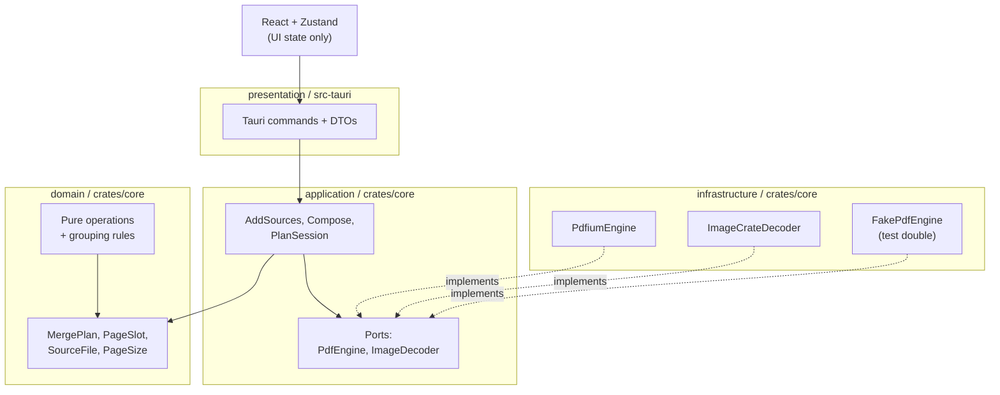

# Architecture (L2)

> Doc layers: L1 = [`/CLAUDE.md`](../CLAUDE.md) / L2 = this file / L3 = [`docs/development.md`](development.md).
> The authoritative design lives in Notion; the local mirror is `docs/superpowers/specs/` (git-ignored).
> This file summarises that design for people reading the code — it is not a copy of it. Where the
> two disagree, the design is canonical and this file should be corrected.

## Overview

PDF Tools merges PDFs and images into one PDF. Its central abstraction is the **merge plan**: an
ordered list of _slots_, where one slot is exactly one page of the output. Every user action —
add, insert, reorder, delete, undo — is a pure function from one plan to the next.

| Term                        | Meaning                                                                                 |
| --------------------------- | --------------------------------------------------------------------------------------- |
| `PageSlot`                  | One output page. Carries a `SlotId`, the source it came from, and a page index.         |
| `MergePlan`                 | The ordered `Vec<PageSlot>`. Vector order _is_ output page order.                       |
| `SourceFile`                | One file the user added: a PDF or an image.                                             |
| Group                       | A contiguous run of slots from one source, drawn as a single card.                      |
| probe / rasterize / compose | The three PDF engine operations: read metadata / render a page / write the merged file. |

`SlotId` is a standalone monotonic id rather than `(source, page)`, because the same page may
appear more than once in a plan and a composite key would make those duplicates indistinguishable
in the UI.

## Crate layout and dependency rule

Two crates in one Cargo workspace:

- `crates/core` — `domain`, `application`, `infrastructure`
- `src-tauri` — `presentation` (Tauri commands, DTOs, app state) plus the binary



**Dependencies flow in one direction only:** presentation → application → domain, and
infrastructure → domain. Nothing flows back. Concretely:

- **`domain` is pure.** No IO, no async, no external crates. It is `MergePlan`, `PageSlot`,
  `SourceFile`, `PageSize`, the three plan operations (`insert_at` / `remove` / `reorder`), the
  grouping rules, and `dominant_page_size`. All of it is unit- and property-testable with no
  fixtures.
- **`application` owns the use cases and the ports.** `AddSources` probes new files and appends
  their slots; `Compose` resolves a plan into engine work and reports progress; `PlanSession`
  holds the current plan, the source list, and the undo/redo stacks.
- **`infrastructure` implements the ports.** `PdfiumEngine` (PDFium via `pdfium-render`),
  `ImageCrateDecoder` (the `image` crate), a PNG encoder, and `FakePdfEngine`.
- **`presentation` is thin.** Each Tauri command locks the session, calls one session method or
  use case, and returns a `PlanSnapshot` DTO. The command bodies are split into `*_inner`
  functions that take `&AppState`, so they are testable without a webview.

## The engine port, and why it exists

```rust
pub trait PdfEngine: Send + Sync {
    fn probe(&self, src: &Path) -> Result<DocumentInfo, PdfError>;
    fn rasterize(&self, src: &Path, page: PageIndex, spec: RasterSpec) -> Result<RasterImage, PdfError>;
    fn compose(&self, plan: &ComposePlan, dest: &Path) -> Result<MergeReport, PdfError>;
}

pub trait ImageDecoder: Send + Sync {
    fn probe(&self, src: &Path) -> Result<ImageInfo, ImageError>;
    fn decode_first_frame(&self, src: &Path) -> Result<RasterImage, ImageError>;
}
```

PDFium is a C++ FFI dependency. The port is the escape hatch for a license change, a notarization
problem, or a fatal bug — but only if it stays small. It therefore holds **only the three
operations the app actually performs**, not a wrapper over PDFium's surface.

**The load-bearing constraint is that the port speaks in file paths and page indices and never
exposes an open document handle.** Handle lifetime and any reuse cache stay inside the adapter.
`ComposePlan` is the application layer's resolved form of a `MergePlan`: source ids have already
become paths, and image entries already carry the `PageSize` they must be fitted to, so the engine
needs no knowledge of sources or grouping.

`FakePdfEngine` is the proof that the abstraction holds. **A port with only one possible
implementation is not a port**, so the fake is a real, deterministic, in-memory second
implementation, and every application-layer test runs against it.

## Grouping and regrouping

One rule governs both directions, and it is evaluated only after an operation commits — never
mid-drag:

- **A source ungroups when a slot from another source lands strictly inside its run** (between its
  first and last slot). Insertions at a boundary between groups do not ungroup anything.
- **An ungrouped source regroups automatically once its slots are contiguous again _and_ their
  page numbers increase monotonically.** Deletion leaves gaps (1, 2, 4, 5) that stay monotonic, so
  those refold; a swap (1, 2, 7, 4, 5) does not.

A collapsed card shows the number of pages actually present, not the original page range —
`source.page_count` still counts pages the user has since deleted.

The frontend has its own `groupContiguous` (`src/lib/grouping.ts`) that mirrors
`domain::grouping::group_contiguous`. This is display-only derivation from a snapshot the backend
already produced; the _decision_ about grouped versus ungrouped is made in Rust and shipped in the
snapshot.

## Immutability and undo

```rust
pub fn insert_at(plan: &MergePlan, at: usize, slots: &[PageSlot]) -> MergePlan
pub fn remove(plan: &MergePlan, ids: &[SlotId]) -> MergePlan
pub fn reorder(plan: &MergePlan, from: Range<usize>, to: usize) -> MergePlan
```

Every operation returns a new plan, so undo/redo is nothing but a stack of plans in `PlanSession`.
A `PageSlot` is about 16 bytes, so even a 1000-page plan costs ~16 KB per stack entry — cheap
enough that no diffing scheme is warranted.

## State ownership

| Kind                     | Home                       | Contents                                                                                              |
| ------------------------ | -------------------------- | ----------------------------------------------------------------------------------------------------- |
| Canonical document state | **Rust (`crates/core`)**   | `MergePlan`, undo/redo stacks, the `SourceFile` list, each source's grouped/ungrouped state           |
| Transient view state     | **Zustand (`src/store/`)** | expanded/collapsed cards, selection, focus, grid vs list, drag preview position, thumbnail blob cache |

The dividing question is "must undo restore it?". If yes, it lives in Rust.

This is why `plan-store.ts` exposes `setSnapshot` and nothing else: **every command returns a whole
`PlanSnapshot` and the store only ever replaces its contents.** A local `reorder` helper on the
frontend would be a second, divergent implementation of the merge rules.

The only persisted state is user preference, held in `localStorage`: the last output directory
(falling back to the OS Downloads directory) and the grid/list choice. No document state is ever
written to disk.

## Command surface and IPC

Every plan command returns a fresh `PlanSnapshot`.

| Command                          | Semantics                                                                          |
| -------------------------------- | ---------------------------------------------------------------------------------- |
| `add_sources(paths)`             | Probe each file, append its slots to the end of the plan                           |
| `insert_at(index, slot_ids)`     | Insert at a position; ungroup the affected source if the insert lands inside a run |
| `reorder(from, to)`              | Move a contiguous range, then re-evaluate regrouping                               |
| `remove_slots(slot_ids)`         | Delete slots, drop sources that lost all of theirs, then re-evaluate regrouping    |
| `undo()` / `redo()`              | Move along the plan stack                                                          |
| `rasterize_slot(slot_id, width)` | Render one slot to PNG (does **not** return a plan)                                |
| `compose(dest)`                  | Run the merge; progress arrives as `compose-progress` events                       |
| `pdfium_health()`                | Report whether PDFium loaded, and its version                                      |

Two shapes are deliberate:

- **Thumbnails cross the IPC boundary as raw PNG bytes** in a `tauri::ipc::Response`, never as
  base64 or a JSON number array. The frontend wraps them in blob URLs held by an LRU cache
  (`src/lib/thumbnail-cache.ts`) that revokes each URL on eviction.
- **`compose` runs on `spawn_blocking`, and clones the plan and sources out of the session before
  it starts.** The lock is released before the engine runs, so a long merge never blocks the
  commands the UI issues meanwhile, and the merge cannot mutate the plan underneath the user.

DTO types are generated by `ts-rs` into `src/bindings/` and committed, so a change to a Rust DTO
breaks the TypeScript build rather than failing silently at runtime.

## Image pages

An image page is fitted to the **dominant page size**: the most frequent size among the plan's
PDF-backed slots, ties broken by first appearance in the plan, A4 portrait when the plan has no
PDF pages at all. Sizes within 1 pt count as equal. The aspect ratio is preserved and the
remaining area is white. An animated GIF contributes its first frame only.

## Error handling

The trust boundary is **the files the user drops in**, and one bad file must never stop the batch.

- **Encrypted PDF** — detected at `probe`; the card goes to an error state and the source is
  excluded from the merge. No password prompt exists.
- **Corrupt PDF or undecodable image** — same treatment, with the reason shown on the card.
- **File moved or deleted after being added** — detected at `compose`; the merge stops and names
  the offending file in the error dialog.

`PdfError` and `ImageError` are `thiserror` enums whose messages name the path and the reason;
presentation maps them to strings for the dialog.

## Security

- PDF parsers are a historic source of memory-safety bugs. PDFium's version is pinned and tracked
  by Renovate; `crates/core` is `#![forbid(unsafe_code)]`.
- The PDFium binary is fetched from a pinned release and **verified by SHA-256; a mismatch fails
  the build** (`scripts/fetch-pdfium.sh`, checksums in `scripts/pdfium-checksums.txt`).
- **Raw PDF bytes never reach the WebView** — only rasterized PNGs do.
- Tauri capabilities are limited to the dialog and opener plugins.
- The app makes no network requests, so there is no authentication, transport or server-side
  attack surface to reason about. Logs record file paths but never file contents.

## Service level objectives

The design doc's SLO table was entirely estimated. The **Target** column below still holds those
estimates; the **Status** and **Measured** columns record what has actually been measured during
implementation. **Every row states whether it was measured or not, and no estimate is presented as
a measurement.**

Measurement environment: Apple Silicon / macOS, Rust 1.97.1, `--release` for Rust figures,
jsdom + Vitest for frontend figures.

| Objective                                        | Target             | Status                                                                   | Measured                                                                                                                                                                      |
| ------------------------------------------------ | ------------------ | ------------------------------------------------------------------------ | ----------------------------------------------------------------------------------------------------------------------------------------------------------------------------- |
| Cold start                                       | ≤ 2 s (p95)        | **Not measured** — needs a GUI session                                   | —                                                                                                                                                                             |
| 20 files added → all cards shown                 | ≤ 3 s (probe only) | **Not measured** end to end; the JS-side portion is measured (see below) | —                                                                                                                                                                             |
| Thumbnail shown (visible range)                  | ≤ 300 ms (p95)     | **Not measured** — needs real PDFium rasterization in a WebView          | —                                                                                                                                                                             |
| Reorder: drop → screen update                    | ≤ 100 ms (p95)     | **Met, measured**                                                        | ≈ 1 ms typical, ≈ 3 ms p95 at 1000 slots — two orders of magnitude under target ([issue #21](https://github.com/yasuflatland-lf/pdf-tools/issues/21#issuecomment-5134952236)) |
| Merge 100 pages / ~100 MB                        | ≤ 10 s             | **Not met, measured**                                                    | 13.1–13.6 s for 100 JPEGs / 93.8 MB. 100 PDF pages alone: 0.001 s ([issue #28](https://github.com/yasuflatland-lf/pdf-tools/issues/28#issuecomment-5134973783))               |
| Peak memory, normal scale                        | ≤ 500 MB           | **Not measured** — needs process-level measurement of the real app       | —                                                                                                                                                                             |
| 1000 pages: scroll at 60 fps, peak memory ≤ 1 GB | —                  | **Not measured** — needs a GUI session                                   | —                                                                                                                                                                             |
| Crashes over a 100-document PDF corpus           | 0                  | **Not measured** — no corpus run has been performed                      | —                                                                                                                                                                             |

### What was measured, and where

**Reorder responsiveness** ([issue #21](https://github.com/yasuflatland-lf/pdf-tools/issues/21#issuecomment-5134952236)) —
Rust `reorder` over 50 trials, frontend re-render over 20 trials:

| Slots | Rust `reorder` p50 / p95 | Snapshot JSON | Frontend re-render p50 / p95 |
| ----- | ------------------------ | ------------- | ---------------------------- |
| 10    | < 0.001 / 0.001 ms       | 473 B         | 0.83 / 2.46 ms               |
| 100   | < 0.001 / 0.001 ms       | 3.3 kB        | 0.86 / 1.90 ms               |
| 1000  | 0.005 / 0.011 ms         | 33 kB         | 0.95 / 2.26 ms               |

Serializing a 1000-slot snapshot takes 0.026 ms (p50). **This settles the design doc's open
question about IPC transfer cost:** the frontend re-render is more than 30× heavier than
serializing the whole snapshot, so a diff protocol would not measurably improve the total.
Returning the full snapshot stays. Revisit only if slot counts grow by an order of magnitude
(10 000 slots ≈ 330 kB) or per-slot payload grows.

**Frontend behaviour at 1000 pages**
([issue #16](https://github.com/yasuflatland-lf/pdf-tools/issues/16#issuecomment-5134665048)) —
measured in jsdom, so these are JS-layer costs only:

| Item                                                  | Value                                                |
| ----------------------------------------------------- | ---------------------------------------------------- |
| `groupContiguous`, 1000 slots, grouped → 1 card       | 0.15 ms                                              |
| `groupContiguous`, 1000 slots, ungrouped → 1000 cards | 0.14 ms                                              |
| `cache.get` × 1000 (capacity 100, 48 KB each)         | 13.08 ms; all 900 evictions revoked their object URL |
| Initial grid mount for a 1000-page plan               | 10.61 ms                                             |
| Node heap right after                                 | 58.5 MB (the jsdom process, **not** WebView memory)  |

Virtualization was verified separately: with an 800×600 viewport, a 200-page plan issues 8
`rasterize_slot` calls (4 columns × 2 rows) and never requests the tail. The count is constant in
plan length, so 1000 pages issues the same 8.

**Merge throughput** ([issue #28](https://github.com/yasuflatland-lf/pdf-tools/issues/28#issuecomment-5134973783)) —
a headless harness driving the real `PdfiumEngine` and the `Compose` use case, PDFium
`FPDF API V7881`:

| Input                         | Output              | Time                        |
| ----------------------------- | ------------------- | --------------------------- |
| 100 JPEGs, 2048×1536, 93.8 MB | 100 pages, 858.9 MB | 13.1 / 13.4 / 13.5 / 13.6 s |
| 100-page PDF, 45.5 kB         | 100 pages, 45.5 kB  | 0.001 s                     |

Copying PDF pages is free; the entire cost is image embedding. Output inflating ~9× (≈ 8.6 MB per
page against 2048 × 1536 × 3 B ≈ 9.4 MB) shows images are embedded as **uncompressed bitmaps** in
`infrastructure/pdfium/compose.rs`. Quadrupling input bytes only multiplies time by ~1.3, which
confirms pixel count — not file size — dominates. Meeting the 10 s target requires passing the
original JPEG stream through, or applying DCTDecode/FlateDecode on embed. **This is a known
v1.0.0 limitation, not a resolved item.**

### Why some rows are still unmeasured

Scroll frame rate, real peak memory and cold start are properties of the packaged app running in
a WebView. Every number above was produced in a headless environment (jsdom for the frontend, a
native release binary for Rust), where those three quantities either do not exist or do not
correspond to anything a user would experience. They remain open and require a GUI session on
each target platform.
