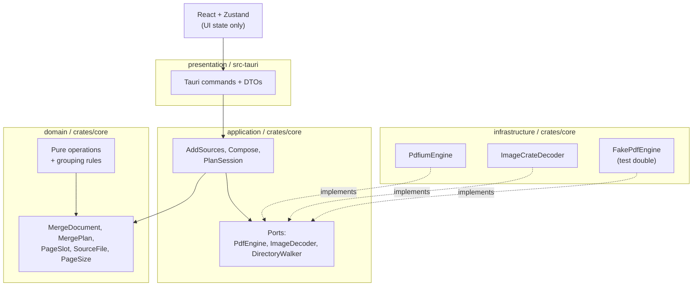

# Architecture (L2)

> Doc layers: L1 = [`/CLAUDE.md`](../CLAUDE.md) / L2 = this file / L3 = [`docs/development.md`](development.md).
> The authoritative design lives in Notion; the local mirror is `docs/superpowers/specs/` (git-ignored).
> This file summarises that design for people reading the code — it is not a copy of it. Where the
> two disagree, the design is canonical and this file should be corrected.

## Overview

PDF Tools merges PDFs and images into one PDF. Its central abstraction is the **merge plan**: an
ordered list of _slots_, where one slot is exactly one page of the output. Every user action —
add, insert, reorder, rotate, delete, undo — is a pure function from one plan to the next.

| Term                        | Meaning                                                                                 |
| --------------------------- | --------------------------------------------------------------------------------------- |
| `PageSlot`                  | One output page. Carries its id, source, page index, and clockwise quarter-turn state.  |
| `MergePlan`                 | The ordered `Vec<PageSlot>`. Vector order _is_ output page order.                       |
| `SourceFile`                | One file the user added: a PDF or an image.                                             |
| `MergeDocument`             | A `MergePlan` and its sources, with every slot guaranteed to name a listed source.      |
| Group                       | A contiguous run of slots from one source, drawn as a single card.                      |
| probe / rasterize / compose | The three PDF engine operations: read metadata / render a page / write the merged file. |

`SlotId` is a standalone monotonic id rather than `(source, page)`, because the same page may
appear more than once in a plan and a composite key would make those duplicates indistinguishable
in the UI. That support does not make duplicates groupable: while both copies remain, their source
stays ungrouped under the strict-ascent rule below.

## Crate layout and dependency rule

Two crates in one Cargo workspace:

- `crates/core` — `domain`, `application`, `infrastructure`
- `src-tauri` — `presentation` (Tauri commands, DTOs, app state) plus the binary



**Dependencies flow in one direction only:** presentation → application → domain, and
infrastructure → domain. Nothing flows back. Concretely:

- **`domain` is pure.** No IO, no async, no external crates. It is `MergeDocument`, `MergePlan`,
  `PageSlot`, `SourceFile`, `PageSize`, the plan operations (`insert_at` / `remove` / `reorder` /
  `rotate`), and the document's grouping and dominant-page-size queries. All of it is unit- and
  property-testable with no fixtures.
- **`application` owns the use cases and the ports.** `AddSources` probes new files and appends
  their slots; `Compose` resolves a plan into engine work and reports progress; `PlanSession`
  holds the current document and its undo/redo stacks. `ExpandSources` resolves the folders in a
  picked or dropped selection to the supported files inside them, in natural order, so the same
  folder yields the same document however it arrived. `RasterizeSlot` renders one slot to pixels,
  sending it to the PDF engine or to the image decoder according to its source's kind, so that
  choice lives beside `Compose`'s rather than in a command. Its `SlotTarget::resolve` is the
  separate, cheap first half: it copies the one path, kind and page index the engine needs, so a
  thumbnail request can release the session lock before rendering without copying the plan.
- **`infrastructure` implements the ports.** `PdfiumEngine` (PDFium via `pdfium-render`),
  `ImageCrateDecoder` (the `image` crate), a PNG encoder, `StdFsWalker`, and `FakePdfEngine`.
- **`presentation` is thin.** Each Tauri command locks the session, calls one session method or
  use case, and returns a `PlanSnapshot` DTO. The command bodies are split into `*_inner`
  functions that take `&AppState`, so they are testable without a webview.

## The engine port, and why it exists

```rust
pub trait PdfEngine: Send + Sync {
    fn probe(&self, src: &Path) -> Result<DocumentInfo, PdfError>;
    fn rasterize(&self, src: &Path, page: PageIndex, spec: RasterSpec) -> Result<RasterImage, PdfError>;
    fn compose(&self, plan: &ComposePlan, dest: &Path) -> Result<MergeReport, PdfError>;
}

pub trait ImageDecoder: Send + Sync {
    fn probe(&self, src: &Path) -> Result<ImageInfo, ImageError>;
    fn decode_first_frame(&self, src: &Path) -> Result<RasterImage, ImageError>;
}
```

PDFium is a C++ FFI dependency. The port is the escape hatch for a license change, a notarization
problem, or a fatal bug — but only if it stays small. It therefore holds **only the three
operations the app actually performs**, not a wrapper over PDFium's surface.

**The load-bearing constraint is that the port speaks in file paths and page indices and never
exposes an open document handle.** Handle lifetime and any reuse cache stay inside the adapter.
`ComposePlan` is the application layer's resolved form of a `MergePlan`: source ids have already
become paths, and image entries already carry the `PageSize` they must be fitted to, so the engine
needs no knowledge of sources or grouping.

`FakePdfEngine` is the proof that the abstraction holds. **A port with only one possible
implementation is not a port**, so the fake is a real, deterministic, in-memory second
implementation, and every application-layer test runs against it.

## Grouping and regrouping

One rule governs both directions, and it is evaluated only after an operation commits — never
mid-drag:

- **A source ungroups when an operation leaves its slots non-contiguous, no longer ascending, or
  with mixed rotation.** A drag can break the first two conditions; rotating only part of a run
  breaks the third.
- **An ungrouped source regroups automatically once its slots are contiguous again _and_ their
  page numbers strictly increase _and_ every slot has the same rotation.** Deletion leaves gaps
  (1, 2, 4, 5) that stay ascending, so those refold; a swap (1, 2, 7, 4, 5) does not. Turning the
  odd page back refolds a mixed-rotation run. A source with two copies of the same page stays
  ungrouped for as long as both copies remain in the plan. The ascent is strict rather than
  non-decreasing because a collapsed card's page count would otherwise misdescribe a run holding
  a page twice.

A collapsed card shows the number of pages actually present, not the original page range —
`source.page_count` still counts pages the user has since deleted.

Folding a run into a card is derived in the frontend by `groupContiguous`
(`src/lib/grouping.ts`) from the snapshot the backend produced. Rust derives the grouped/ungrouped
decision from the plan on demand with `can_regroup` and ships that projection in the snapshot.
The frontend repeats the same-rotation condition because one collapsed thumbnail can truthfully
represent only a run whose pages share an orientation.

## Immutability and undo

```rust
pub fn insert_at(plan: &MergePlan, at: usize, slots: &[PageSlot]) -> MergePlan
pub fn remove(plan: &MergePlan, ids: &[SlotId]) -> MergePlan
pub fn reorder(plan: &MergePlan, from: Range<usize>, to: usize) -> MergePlan
pub fn rotate(plan: &MergePlan, ids: &[SlotId], delta: i8) -> MergePlan
```

Every operation returns a new plan. `PlanSession` pairs that plan with its sources in a
`MergeDocument`, so undo/redo is nothing but stacks of documents. The history retains the most
recent 100 states and discards older ones, so undoing to exhaustion returns to the oldest retained
state, not necessarily to the empty document the session started from. A `PageSlot` is 24 bytes
(two `u64` ids plus a `u32` page index, padded), so even a 1000-page plan costs ~24 KB per stack
entry — cheap enough that no diffing scheme is warranted.

## State ownership

| Kind                     | Home                       | Contents                                                                                              |
| ------------------------ | -------------------------- | ----------------------------------------------------------------------------------------------------- |
| Canonical document state | **Rust (`crates/core`)**   | `MergeDocument` plus undo/redo stacks                                                                 |
| Derived document data    | **Rust → snapshot**        | Each source's grouped/ungrouped decision, computed from `MergePlan` by `can_regroup`                  |
| Transient view state     | **Zustand (`src/store/`)** | expanded/collapsed cards, selection, focus, grid vs list, drag preview position, thumbnail blob cache |

The dividing question is "must undo restore it?". If yes, it lives in Rust or is derived from
canonical Rust state. Grouping needs no stored flag: undo restores the plan, which restores
everything derived from that plan, including the grouping decision shipped to the frontend.

This is why `plan-store.ts` replaces its contents only from whole `PlanSnapshot` values. Its
`rotate` action delegates to Rust and installs the returned snapshot; it does not rotate a local
copy. A local implementation of `rotate` or `reorder` would be a second, divergent copy of the
merge rules.

The only persisted state is user preference, held in `localStorage`: the last output directory
(falling back to the OS Downloads directory) and the grid/list choice. No document state is ever
written to disk.

### Poisoned session locks

`AppState::session()` deliberately recovers a poisoned plan-session lock instead of propagating
the poisoning. `PlanSession` mutations install replacement values as a whole, so a command that
panics cannot expose a half-updated document. Propagating the poisoning would instead force a
restart and lose the user's document, trading that unrecoverable outcome against a hypothetical
inconsistent state. The recovery decision is documented on the accessor itself, so it cannot be
mistaken for an oversight and quietly "fixed" into a propagation.

Making that recovery observable — a `tracing::warn!` on the recovery path, and a regression test
pinning that a panic while the session is locked does not lose the document — lands with
[issue #69](https://github.com/yasuflatland-lf/pdf-tools/issues/69) in the same post-0.1.0 batch.

## Command surface and IPC

Every plan command returns a fresh `PlanSnapshot`.

| Command                          | Semantics                                                                       |
| -------------------------------- | ------------------------------------------------------------------------------- |
| `add_sources(paths)`             | Probe each file, append its slots to the end of the plan                        |
| `expand_paths(paths)`            | Resolve folders to the supported files inside them (does **not** return a plan) |
| `reorder(from, to)`              | Move a contiguous range, then re-evaluate regrouping                            |
| `remove_slots(slot_ids)`         | Delete slots, drop sources that lost all of theirs, then re-evaluate regrouping |
| `rotate_slots(slot_ids, delta)`  | Turn surviving slots clockwise modulo four, then re-evaluate regrouping         |
| `undo()` / `redo()`              | Move along the plan stack                                                       |
| `rasterize_slot(slot_id, width)` | Render one slot to PNG (does **not** return a plan)                             |
| `compose(dest)`                  | Run the merge; progress arrives as `compose-progress` events                    |

Two shapes are deliberate:

- **Plan mutations return the whole canonical snapshot.** Unknown slot ids are ignored, and an
  empty or otherwise unchanged rotation does not add an undo entry.
- **`expand_paths` answers a question rather than making a change.** Splitting it from
  `add_sources` is what lets the frontend see how many files a folder holds, and ask about a
  large one, before anything enters the plan. A single command could not ask.
- **Thumbnails cross the IPC boundary as raw PNG bytes** in a `tauri::ipc::Response`, never as
  base64 or a JSON number array. The frontend wraps them in blob URLs held by an LRU cache
  (`src/lib/thumbnail-cache.ts`) that revokes each URL on eviction. Rotation is a CSS transform
  over those bytes: the cache key remains `slotId:width`, and the fitting scale keeps an odd
  quarter turn inside the virtualized card's unchanged frame without another rasterization call.
- **`compose` runs on `spawn_blocking`, and clones the plan and sources out of the session before
  it starts.** The lock is released before the engine runs, so a long merge never blocks the
  commands the UI issues meanwhile, and the merge cannot mutate the plan underneath the user.
  **`compose-progress` does not yet track the merge page by page:** `Compose` emits every tick
  before it calls the engine, so the bar fills immediately and the UI then waits with no further
  feedback. Reporting from inside the engine loop needs a progress callback on the port.

DTO types are generated by `ts-rs` into `src/bindings/` and committed, so a change to a Rust DTO
breaks the TypeScript build rather than failing silently at runtime.

## Image pages

An image page is fitted to the **dominant page size**: the most frequent effective size among the
plan's PDF-backed slots, after each slot's rotation exchanges its axes when necessary. Ties are
broken by first appearance in the plan, with A4 portrait used when the plan has no PDF pages at
all. Sizes are classified by rounding each dimension to a cell on a 1 pt lattice, so the
classification is independent of the order pages were added in.

The image keeps its aspect ratio and the remaining sheet area is white. Its own rotation does not
change `fit_to`: composition creates the sheet at the dominant size, places the image through the
normal path, and then writes the rotation as the PDF page attribute. JPEG passthrough therefore
remains untouched, and image-backed and PDF-backed slots follow the same turned-sheet rule. For a
copied PDF page, the slot rotation is added to any rotation already declared by the source. An
animated GIF contributes its first frame only.

## Error handling

The trust boundary is **the files the user drops in**, and one bad file must never stop the batch.

- **Encrypted PDF** — detected at `probe`; the card goes to an error state and the source is
  excluded from the merge. No password prompt exists.
- **Corrupt PDF or undecodable image** — same treatment, with a typed, user-facing explanation
  shown on the card.
- **File moved or deleted after being added** — detected at `compose`; the merge stops and names
  the offending file in the error dialog.

`PdfError` and `ImageError` are `thiserror` enums whose messages name the path and the reason.
At probe time, application maps them to typed unreadable reasons for the card and logs the engine
message; presentation still maps compose failures to strings for the dialog.

## Security

- PDF parsers are a historic source of memory-safety bugs. PDFium's version is pinned and tracked
  by Renovate; `crates/core` is `#![forbid(unsafe_code)]`.
- The PDFium binary is fetched from a pinned release and **verified by SHA-256; a mismatch fails
  the build** (`scripts/fetch-pdfium.sh`, checksums in `scripts/pdfium-checksums.txt`).
- **Raw PDF bytes never reach the WebView** — only rasterized PNGs do.
- Tauri capabilities are limited to the dialog and opener plugins.
- The app makes no network requests, so there is no authentication, transport or server-side
  attack surface to reason about. Logs record file paths but never file contents.

## Service level objectives

The design doc's SLO table was entirely estimated. The **Target** column below still holds those
estimates; the **Status** and **Measured** columns record what has actually been measured during
implementation. **Every row states whether it was measured or not, and no estimate is presented as
a measurement.**

Measurement environment: Apple Silicon / macOS, Rust 1.97.1, `--release` for Rust figures,
jsdom + Vitest for frontend figures.

| Objective                                        | Target             | Status                                                                   | Measured                                                                                                                                                                                                                                                                                                                                                                                                                                                                                                                                                                                       |
| ------------------------------------------------ | ------------------ | ------------------------------------------------------------------------ | ---------------------------------------------------------------------------------------------------------------------------------------------------------------------------------------------------------------------------------------------------------------------------------------------------------------------------------------------------------------------------------------------------------------------------------------------------------------------------------------------------------------------------------------------------------------------------------------------- |
| Cold start                                       | ≤ 2 s (p95)        | **Not measured** — needs a GUI session                                   | —                                                                                                                                                                                                                                                                                                                                                                                                                                                                                                                                                                                              |
| 20 files added → all cards shown                 | ≤ 3 s (probe only) | **Not measured** end to end; the JS-side portion is measured (see below) | —                                                                                                                                                                                                                                                                                                                                                                                                                                                                                                                                                                                              |
| Thumbnail shown (visible range)                  | ≤ 300 ms (p95)     | **Not measured** — needs real PDFium rasterization in a WebView          | —                                                                                                                                                                                                                                                                                                                                                                                                                                                                                                                                                                                              |
| Reorder: drop → screen update                    | ≤ 100 ms (p95)     | **Met, measured**                                                        | ≈ 1 ms typical, ≈ 3 ms p95 at 1000 slots — two orders of magnitude under target ([issue #21](https://github.com/yasuflatland-lf/pdf-tools/issues/21#issuecomment-5134952236))                                                                                                                                                                                                                                                                                                                                                                                                                  |
| Merge 100 pages / ~100 MB                        | ≤ 10 s             | **Met at the stated scale on both paths — measured**                     | JPEG passthrough: 0.21 s / 100 pages / 203.7 MB. Raster at the objective's scale: 7.48 s for 100 photo-like pages, 43.8 MB in and 111.7 MB out ([issue #68](https://github.com/yasuflatland-lf/pdf-tools/issues/68#issuecomment-5137691880)). A 900.2 MB noisy-PNG corpus — nine times the objective's size — takes 11.63 s ([issue #68](https://github.com/yasuflatland-lf/pdf-tools/issues/68#issuecomment-5137808149)). Apple M5 Pro, macOS 26.5.2, `--release`. 100 PDF pages alone: 0.001 s ([issue #28](https://github.com/yasuflatland-lf/pdf-tools/issues/28#issuecomment-5134973783)) |
| Peak memory, normal scale                        | ≤ 500 MB           | **Not measured** — needs process-level measurement of the real app       | —                                                                                                                                                                                                                                                                                                                                                                                                                                                                                                                                                                                              |
| 1000 pages: scroll at 60 fps, peak memory ≤ 1 GB | —                  | **Not measured** — needs a GUI session                                   | —                                                                                                                                                                                                                                                                                                                                                                                                                                                                                                                                                                                              |
| Crashes over a 100-document PDF corpus           | 0                  | **Not measured** — no corpus run has been performed                      | —                                                                                                                                                                                                                                                                                                                                                                                                                                                                                                                                                                                              |

### What was measured, and where

**Reorder responsiveness** ([issue #21](https://github.com/yasuflatland-lf/pdf-tools/issues/21#issuecomment-5134952236)) —
Rust `reorder` over 50 trials, frontend re-render over 20 trials:

| Slots | Rust `reorder` p50 / p95 | Snapshot JSON | Frontend re-render p50 / p95 |
| ----- | ------------------------ | ------------- | ---------------------------- |
| 10    | < 0.001 / 0.001 ms       | 473 B         | 0.83 / 2.46 ms               |
| 100   | < 0.001 / 0.001 ms       | 3.3 kB        | 0.86 / 1.90 ms               |
| 1000  | 0.005 / 0.011 ms         | 33 kB         | 0.95 / 2.26 ms               |

Serializing a 1000-slot snapshot takes 0.026 ms (p50). **This settles the design doc's open
question about IPC transfer cost:** the frontend re-render is more than 30× heavier than
serializing the whole snapshot, so a diff protocol would not measurably improve the total.
Returning the full snapshot stays. Revisit only if slot counts grow by an order of magnitude
(10 000 slots ≈ 330 kB) or per-slot payload grows.

**Frontend behaviour at 1000 pages**
([issue #16](https://github.com/yasuflatland-lf/pdf-tools/issues/16#issuecomment-5134665048)) —
measured in jsdom, so these are JS-layer costs only:

| Item                                                  | Value                                                |
| ----------------------------------------------------- | ---------------------------------------------------- |
| `groupContiguous`, 1000 slots, grouped → 1 card       | 0.15 ms                                              |
| `groupContiguous`, 1000 slots, ungrouped → 1000 cards | 0.14 ms                                              |
| `cache.get` × 1000 (capacity 100, 48 KB each)         | 13.08 ms; all 900 evictions revoked their object URL |
| Initial grid mount for a 1000-page plan               | 10.61 ms                                             |
| Node heap right after                                 | 58.5 MB (the jsdom process, **not** WebView memory)  |

Virtualization was verified separately: with an 800×600 viewport, a 200-page plan issues 8
`rasterize_slot` calls (4 columns × 2 rows) and never requests the tail. The count is constant in
plan length, so 1000 pages issues the same 8.

**Merge throughput** ([issue #68](https://github.com/yasuflatland-lf/pdf-tools/issues/68#issuecomment-5137808149)) —
measured on an Apple M5 Pro running macOS 26.5.2, with a `--release` build and PDFium
`chromium/7961`. The corpus contains 100 synthetic images at 2048×1536. Each is composed onto
`PageSize::A4_PORTRAIT` in a 595×446 pt frame, whose 200 DPI budget is 1652×1239 px, or 65% of
the source pixel count:

| Path                          | Input    | Time    | Output   | Filter      |
| ----------------------------- | -------- | ------- | -------- | ----------- |
| JPEG passthrough              | 203.7 MB | 0.21 s  | 203.7 MB | DCTDecode   |
| PNG raster, uncapped          | 900.2 MB | 13.23 s | 858.7 MB | FlateDecode |
| PNG raster, capped at 200 DPI | 900.2 MB | 11.63 s | 543.0 MB | FlateDecode |

The synthetic corpus has more per-pixel noise than a photograph, so its PNG inputs (9.0 MB each)
and JPEG inputs (2.0 MB each) are larger than typical camera output. Passthrough has no size win
over its own input by construction: it copies the original stream verbatim.

That noise is why the table above is a worst case rather than the objective's case. **The
objective names 100 pages of about 100 MB, and this corpus is 900.2 MB — nine times that.** The
same code was also measured on 100 photo-like pages of the same 2048×1536 dimensions, whose PNG
sources are 438 kB each rather than 9.0 MB
([issue #68](https://github.com/yasuflatland-lf/pdf-tools/issues/68#issuecomment-5137691880)):

| Path              | Input   | Time    | Output    |
| ----------------- | ------- | ------- | --------- |
| JPEG passthrough  | 19.1 MB | 80.3 ms | 18.3 MiB  |
| PNG raster capped | 43.8 MB | 7.48 s  | 111.7 MiB |

That run predates the pinned `chromium/7961` binary — it was taken on `FPDF API V7881` — so its
absolute figure is not directly comparable with the table above. It is the run that sits inside
the objective's size envelope, and there the raster path is under 10 s.

PDFium filters a bitmap-embedded image with `FlateDecode` at save time. The cap removes 36.8% of
the raster output size and 12.1% of its wall-clock time. The time saving is proportionally
smaller because decoding 900 MB of PNG is unaffected by the cap; only the save-time deflate has
fewer pixels to process. A separate design measurement on PDFium `FPDF API V7881` isolated that
cost over 20 images at 2048×1536: save-time deflate accounted for 2.41 s of a 2.50 s merge, while
decode measured 0.21 s and bitmap conversion 0.09 s. Those phase figures belong to the design
build, not the `chromium/7961` run above.

An eligible JPEG is now embedded as its original stream with `DCTDecode`, avoiding both decode
and re-encode. Every other image is decoded and embedded at no more than 200 DPI for the area it
occupies on the page. PDFium exposes no API for embedding a pre-compressed non-JPEG stream, so
PNG and GIF use the cap rather than passthrough. Four-component JPEGs are deliberately excluded:
PDFium accepts them but renders the wrong colours. That failure measured MAD 18.33 against the
raster path in the separate `FPDF API V7881` design measurement; the exclusion itself is pinned by
`a_cmyk_jpeg_is_decoded_rather_than_embedded`, and every filter claim above is asserted by
`image_filters` in `crates/core/tests/pdfium_compose_image.rs`.

Copying PDF pages remains effectively free — 100 PDF pages in 0.001 s
([issue #28](https://github.com/yasuflatland-lf/pdf-tools/issues/28#issuecomment-5134973783)) —
so image embedding is still the whole cost. **At the scale the objective names, both paths are now
under 10 s.** Past that scale the raster path is not, and the cap cannot take it there: what is
left on a 900 MB corpus is PNG decode rather than embedding. The cap bounds the worst case and
removes a third of the output size; it does not make decode cheaper.

### Why some rows are still unmeasured

Scroll frame rate, real peak memory and cold start are properties of the packaged app running in
a WebView. Every number above was produced in a headless environment (jsdom for the frontend, a
native release binary for Rust), where those three quantities either do not exist or do not
correspond to anything a user would experience. They remain open and require a GUI session on
each target platform.
